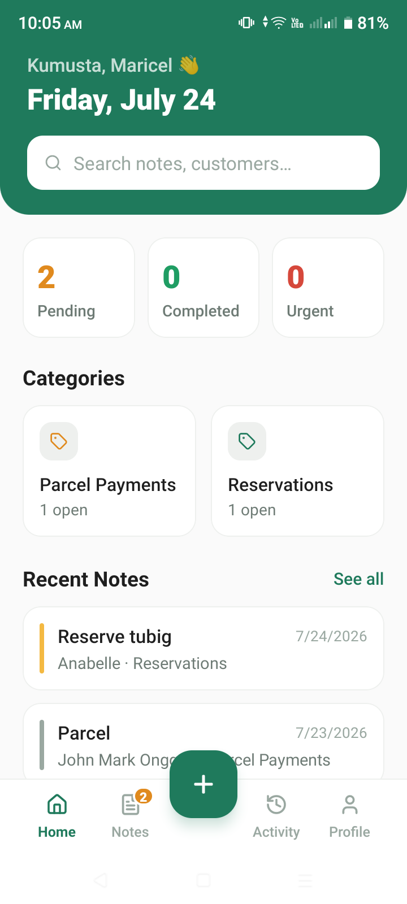
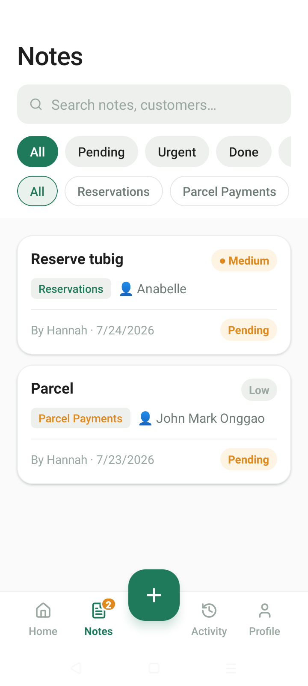
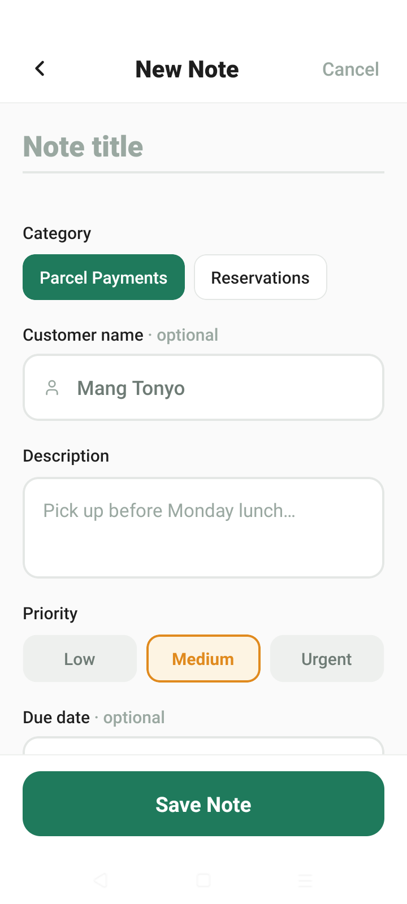
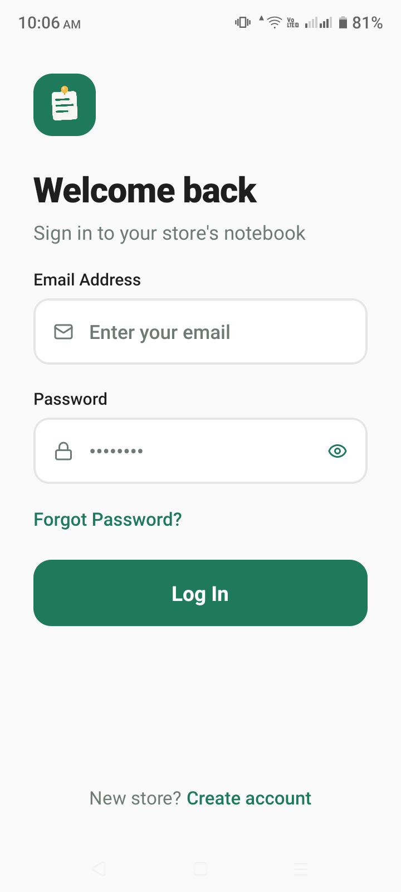
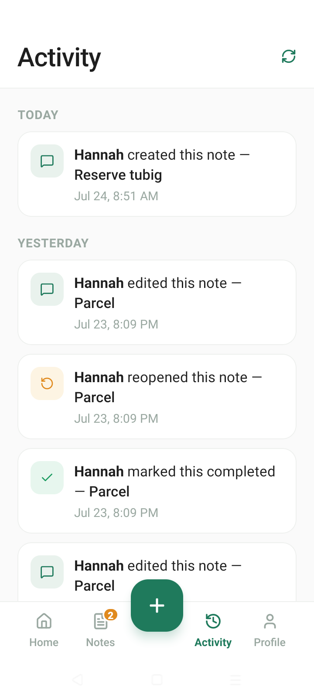

<h1 align="center">TindaNote</h1>

  <strong>One shared notebook for the whole store.</strong> 
  A cross-platform mobile app that keeps sari-sari store vendors in sync across every shift.

  
  
  
  
  

  
  
  

> **Note on the source code**
> This repository is a showcase of the project — screenshots and documentation.
> The source code is kept in a **private repository**. Happy to walk through the
> codebase or grant access on request — just reach out.

---

## About

In a Filipino sari-sari store, the vendors change with the shift — but the information doesn't travel with them. Who reserved the last case of softdrinks? Who paid in advance? Which supplier is coming Thursday? Today that lives on scrap paper, or in whoever's memory happens to be on duty.

**TindaNote** replaces that with one live notebook the whole store shares. Every vendor sees the same reminders, reservations, advance payments, and supplier notes — updated in real time, on every device, across every shift.

## Features

### 🏪 Multi-tenant stores
- Each store is a **separate tenant**, isolated at the database level
- **Postgres row-level security** guarantees no store can ever read another's notes
- Owners define their own **note categories** to match how their store actually works

### 📝 The shared notebook
- Reminders, reservations, advance payments, and supplier notes in one place
- **Live dashboard** of what needs attention
- **Search and filtering** across all notes
- **Activity timeline** — every note-write is logged, so nothing is anonymous

### 🔐 Authentication & roles
- Email authentication using **6-digit one-time codes**
- Full account lifecycle: sign-up confirmation, password reset, and email change
- **Owner and staff roles**, with staff joining via **invite codes**

### ⚡ Realtime sync
- Note changes push to **all devices instantly** via Supabase Realtime
- No refreshing, no stale handovers — the notebook is always current

### ✨ Also included
- Light and dark mode with a persisted theme preference
- Cross-platform (iOS and Android) from one codebase
- Built and distributed with **EAS Build**

---

## Screenshots

| Sign in | Dashboard | Notes |
|:---:|:---:|:---:|
|  |  |  |

| New note | Store & invites | Activity timeline |
|:---:|:---:|:---:|
|  |  |  |

---

## Tech stack

| Layer | Tools |
|---|---|
| App | React Native, Expo, Expo Router, TypeScript |
| State | Zustand |
| Backend | Supabase (Postgres, Auth, Realtime) |
| Security | Postgres row-level security |
| Build | EAS Build |

---

## Engineering notes

A few decisions worth calling out:

- **Isolation is enforced by the database, not the app.** Every store's data is protected by Postgres row-level security policies, so a bug in client code can't leak one store's notes to another. Authorization lives where it can't be bypassed.
- **Realtime over polling.** Shift handover only works if the notebook is current, so note-writes are pushed to every connected device through Supabase Realtime instead of being fetched on an interval.
- **Passwordless-style auth.** Sign-up, password reset, and email changes all run through 6-digit one-time codes, which is far friendlier on mobile than long password flows — and avoids storing another credential.
- **An append-only activity timeline.** Every write is logged with its author, so the store has an audit trail of who recorded what, which matters when money (advance payments, credit) is involved.

---

  Built by <a href="https://github.com/swanjwich">Hannah Tano</a>

